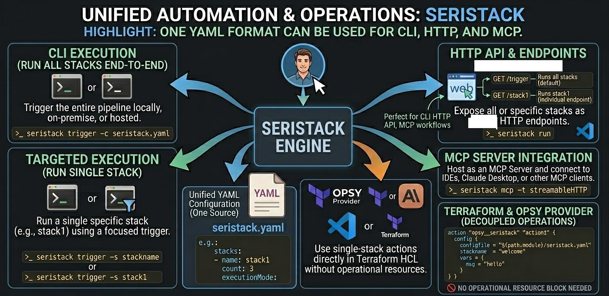

# seristack(v0.1.2)

**Run shell workflows via CLI or HTTP

Seristack is a lightweight automation engine designed to bridge the gap between local task execution and remote triggers. Define your stacks in YAML, manage dependencies, and expose your automation via a built-in HTTP server.

[seristack](https://github.com/TechXploreLabs/seristack)

# Features

    🚀 Run multiple command stacks from a single config
    🔁 Repeat stacks with serial or concurrent execution
    🔗 Define dependencies between stacks
    🧩 Variable substitution using templates
    📦 Share output between stacks
    🌐 Expose stacks as HTTP endpoints
    🧠 Run as an MCP server for IDE integrations
    🛠 Works with Bash, sh, and PowerShell




## Installation

### Using Homebrew (Mac and Linux)

```bash
brew install TechXploreLabs/tap/seristack
```

### Linux (using release archive)

1. Go to [Seristack Releases](https://github.com/TechXploreLabs/seristack/releases) and download the latest `seristack_VERSION_linux_ARCH.tar.gz` (`ARCH` matches your system, e.g., `amd64`, `arm64`).
2. Extract the archive:
   ```bash
   tar -xzf seristack_VERSION_linux_ARCH.tar.gz
   ```
3. Move the `seristack` binary to a directory in your `PATH`:
   ```bash
   sudo mv seristack /usr/local/bin/
   ```
4. Set execute permissions (just in case):
   ```bash
   sudo chmod +x /usr/local/bin/seristack
   ```
5. Verify installation:
   ```bash
   seristack --help
   ```

### Windows (using release archive)

1. Go to [Seristack Releases](https://github.com/TechXploreLabs/seristack/releases) and download the latest `seristack_VERSION_windows_ARCH.zip` or `.gz` file (where `ARCH` matches your system, e.g., `amd64`).
2. Extract the zip/gz file (Right click → Extract all, or use a tool like 7-Zip).
3. Move `seristack.exe` to a folder in your `%PATH%` (such as `C:\Windows`, or better, a custom tools folder included in PATH).
4. Open PowerShell or Command Prompt and verify installation:
   ```powershell
   seristack --help
   ```


# Sample stack yaml file

```yaml
# description about seristack
# config.yaml

stacks:
  - name: stack1                # name of the stack (REQUIRED)
    workDir: ./                 # working directory to execute the cmds. default is "./"
    description: Used for printing  
                  welcome message               # used for adding the stack as tool in mcp server, if descrption is empty then 
                                                # it won't be added
    continueOnError: false      # if cmds has error, true will not stop execution, false will stop. default is false
    count: 3                    # count = 0 will not run cmds, count = 3 runs entire cmds three times. default is 0
    executionMode: PARALLEL     # if count = 3 and executionMode is PARALLEL, then all three iterations of list 
                                # cmds execute parallellely . Valid options are, [PARALLEL/STAGE/PIPELINE/SEQUENTIAL]. 
                                # STAGE = execute all iterations conncurrently, list of cmds execeuted serially
                                # PIPELINE = execute all iterations serially, list of cmds executed concurrently
                                # SEQUENTIAL = execute all iterations and theirs cmds serially. default is PARALLEL
    
    vars:                       # vars take key=value pair of variables. default is empty
      samplekey: samplevalue
    shell: bash                 # shell takes sh as default for linux, darwin and powershell for windows
    shellArg: -c                # shellArg takes -c as default for linux, darwin and -Command for windows
    dependsOn: []               # dependsOn takes list of stacks to start after them. default is []
    cmds:                       # cmds takes list of shell commands (linux, powershell)
      - |
        export samplekey={{.Vars.samplekey}}    # to use vars for substitution
        echo $samplekey
        echo "count={{.Count.index}}"         # index of count iterations
        echo "Hey i'm seristack!"

  - name: stack2
    workDir: ./
    continueOnError: false
    count: 3
    executionMode: SEQUENTIAL
    dependsOn: [stack1]          # runs after stack1 completes
    cmds:
      - |
        echo "Using output from previous stack"
        echo "count={{.Result.stack1}}"     # to use result of previous batch stack output for substitution
      - echo "Using output from previous stack"
      - echo "count={{.Result.stack1}}"

  - name: stack3
    workDir: ./
    count: 1
    vars:
      invite: hello engineers
    cmds:
      - |
        echo "Current date and time:"
        echo `date`

server:
  host: 127.0.0.1      # default is 127.0.0.1, use 0.0.0.0 for exposing it to internet
  port: 8080           # default is 8080
  endpoints:            # endpoint will connect the path to particular stack and run the cmds, publish output
    - path: /show
      method: GET
      stackName: stack3
```

# Running the stacks

1. Trigger entire stacks, default is config.yaml.

```bash
seristack trigger -c config.yaml

or

seristack trigger
```

2. Run the particular stack.

```bash
seristack trigger -c config.yaml -s stack3
```

3. Init the http server with endpoint. ctrl+c will stop the server process.

```bash
seristack run -c config.yaml
```

4. Init the mcpserver. ctrl+c will stop the server process.

```bash
seristack mcp -t streamableHTTP
```

# License

Apache License
